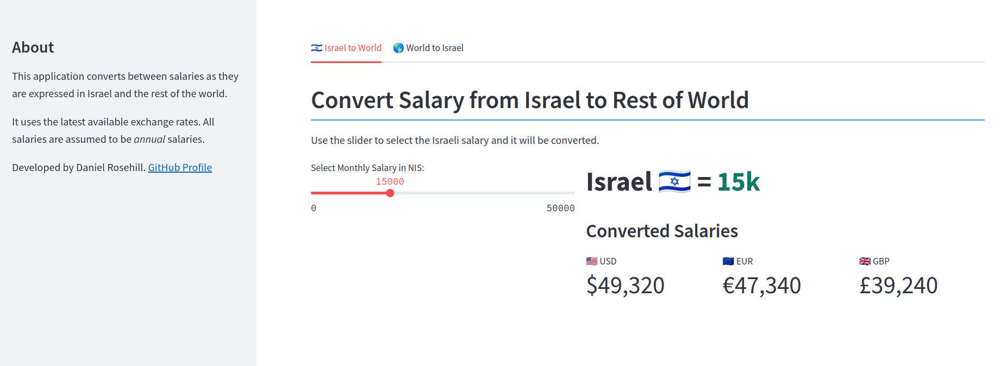
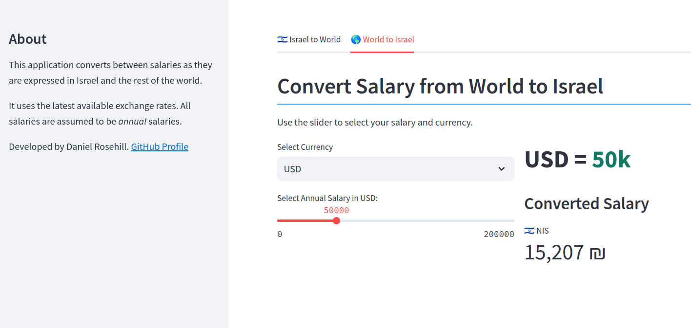

 # Israel To World Salary Conversion Utility (Streamlit)

 

This Streamlit utility converts between Israeli salaries and world salaries. 

In Israel, besides being denominated in New Israeli Shekels (NIS), salaries are usually stated in monthly amounts. 

In order to convert between world salaries and Israeli salaries, multiplication or division by 12 is usually necessary, as well as the currency conversion. 

This application uses a simple slider interface to drag between the Israeli salary and the world salaries. On the World to Israel tab you can choose between one of the 3 supported world currencies USD Euro and GBP and use the slider in the other direction.. 

Daniel Rosehill  
(public at danielrosehill dot com)

## Licensing

This repository is licensed under CC-BY-4.0 (Attribution 4.0 International) 
[License](https://creativecommons.org/licenses/by/4.0/)

### Summary of the License
The Creative Commons Attribution 4.0 International (CC BY 4.0) license allows others to:
- **Share**: Copy and redistribute the material in any medium or format.
- **Adapt**: Remix, transform, and build upon the material for any purpose, even commercially.

The licensor cannot revoke these freedoms as long as you follow the license terms.

#### License Terms
- **Attribution**: You must give appropriate credit, provide a link to the license, and indicate if changes were made. You may do so in any reasonable manner, but not in any way that suggests the licensor endorses you or your use.
- **No additional restrictions**: You may not apply legal terms or technological measures that legally restrict others from doing anything the license permits.

For the full legal code, please visit the [Creative Commons website](https://creativecommons.org/licenses/by/4.0/legalcode).